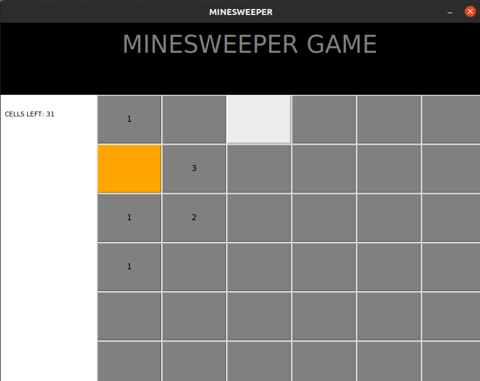
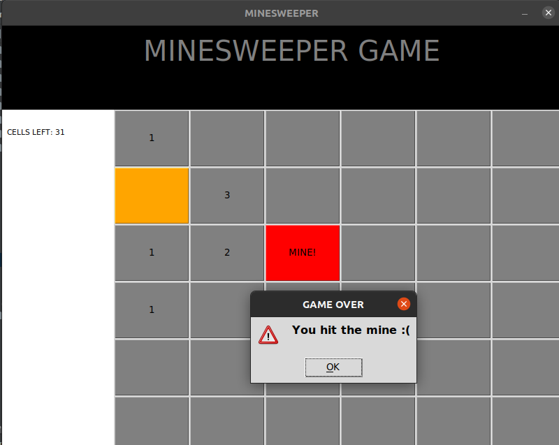

# tkinter-minesweeper

## Description
Minesweeper game with Python and tkinter

- Type: GUI development, OOP approach
- Source: https://www.youtube.com/watch?v=0sOvCWFmrtA
- Date: September/2022

## How to run
- pip install requirements.txt
- python src/main.py

## Status
Game is playable

## App screens:
- in play

- game over

What to improve:
- restart game after loose/win
- add levels and progress to the next in case of win
- timer and score based on how fast was level resolved
- enhance/refine UI
